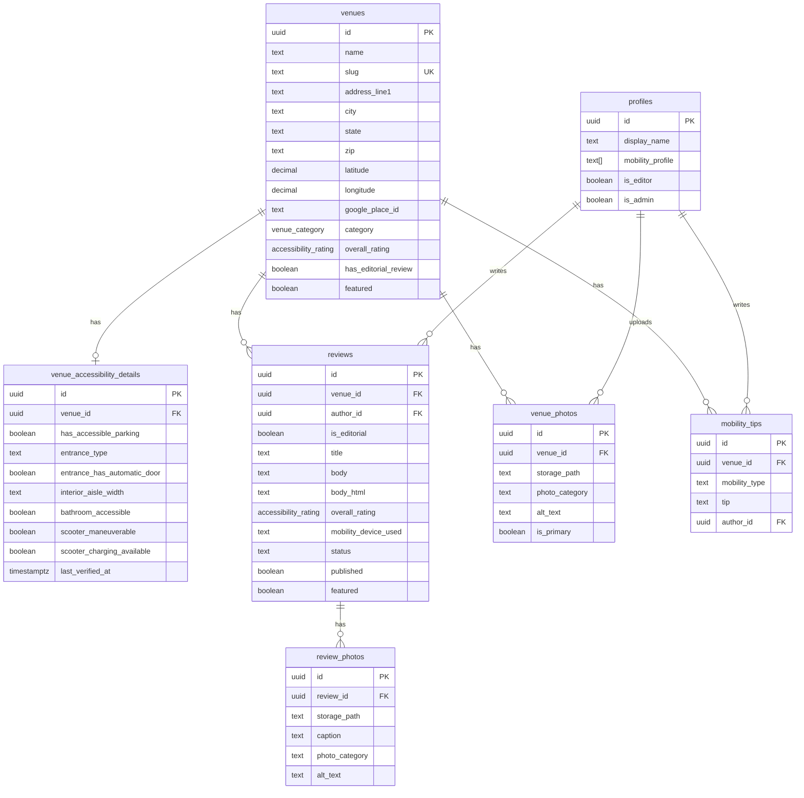

# feat: Build Accessibility Review Website

## Overview

Build a full-stack accessibility review website for people with mobility challenges (wheelchair users, scooter users, walker users, people with gait disorders, temporary injuries, parents with strollers). The site is co-founded by Matthew Brothers (writer, accessibility consultant, TBI survivor with spastic gait who uses a scooter) and Brad Eilerman, MD (technology/strategy).

**Core insight:** Every existing accessibility review app is a database with a community bolted on. This site leads with narrative editorial reviews written by someone who lives this every day, with structured data underneath. Think Wirecutter meets Yelp, but for accessibility.

**Initial geographic focus:** Greater Cincinnati / Northern Kentucky metro area.

## Problem Statement / Motivation

People with mobility challenges have no trustworthy, voice-driven resource for knowing whether a venue is actually accessible before they go. Google Maps "wheelchair accessible" is a binary checkbox that tells you nothing about ramp slopes, bathroom stall widths, scooter maneuverability, or whether the staff treat you like a person. Existing apps (Wheelmap, AccessNow) are databases with star ratings — no narrative voice, no photographic evidence, no scooter-specific data.

This site fills that gap with editorial-quality reviews backed by structured accessibility data.

## Proposed Solution

A Next.js 16 application with Supabase backend, deployed on Vercel. Editorial-first design with structured accessibility data. Five phases of implementation, with Phases 1-4 as MVP.

### Tech Stack (Updated from Origin Spec)

| Component | Origin Spec | Updated To | Reason |
|-----------|-------------|------------|--------|
| Framework | Next.js 14+ | **Next.js 16** | Current stable; proxy.ts, async APIs, Cache Components |
| Styling | Tailwind CSS 3.x | **Tailwind CSS 4** | Current; CSS-based config, @theme blocks |
| Backend | Supabase | Supabase (unchanged) | Postgres + Storage + Auth + RLS |
| Maps | Google Maps API | **@vis.gl/react-google-maps** | Official Google React library (spec requests Google Maps) |
| MDX | next-mdx-remote | **next-mdx-remote-client** | Maintained fork with App Router + MDX v3 support |
| Dark Mode | (unspecified) | **next-themes** | Standard for Next.js, handles SSR flash |
| Icons | Lucide React | Lucide React (unchanged) | |
| Typography Plugin | (unspecified) | **@tailwindcss/typography** | Essential for editorial prose rendering |

### Key Architecture Decisions

1. **Next.js 16 proxy.ts** replaces middleware.ts — handles Supabase session refresh, auth gates
2. **Cache Components** (`'use cache'`) for venue pages and editorial reviews — static shell with dynamic community content
3. **Supabase getClaims()** (not getSession()) for server-side auth validation
4. **Public Supabase Storage bucket** for published review images; signed upload URLs for admin uploads
5. **Mock data first** — build frontend with local JSON mirroring Supabase schema, swap in Supabase later (per origin spec guidance)
6. **next-themes with Tailwind v4 `@custom-variant`** for dark mode (system preference default)
7. **Text alternative alongside maps** — venue data table/list for screen reader users
8. **axe-core in CI** for automated accessibility testing (jest-axe + @axe-core/playwright)

## Technical Approach

### Architecture

```
access-review-site/
├── src/
│   ├── app/                    # Next.js 16 App Router
│   │   ├── layout.tsx          # Root layout (fonts, ThemeProvider, SkipToContent)
│   │   ├── page.tsx            # Homepage
│   │   ├── globals.css         # Tailwind v4 @import, @theme, @custom-variant
│   │   ├── proxy.ts            # Supabase session refresh, auth gates
│   │   ├── venues/
│   │   │   ├── page.tsx        # Browse/Search with filters
│   │   │   └── [slug]/page.tsx # Venue Detail
│   │   ├── reviews/
│   │   │   └── [slug]/page.tsx # Editorial Review (magazine layout)
│   │   ├── about/page.tsx      # About page
│   │   ├── submit/page.tsx     # Review Submission (Phase 5)
│   │   └── not-found.tsx       # Custom 404
│   ├── components/
│   │   ├── ui/                 # Primitives (Badge, Button, Card, Input)
│   │   ├── venue/              # VenueCard, AccessibilityDetailCard, VenueMap, PhotoGallery
│   │   ├── review/             # EditorialReviewHero, ReviewCard
│   │   ├── layout/             # Header, Footer, SearchBar, MobileNav
│   │   ├── home/               # HeroSection, FeaturedReview, CategoryLinks, HowItWorks
│   │   └── shared/             # NewsletterSignup, DarkModeToggle, SkipToContent, FocusManager
│   ├── lib/
│   │   ├── supabase/           # client.ts, server.ts (async cookies for Next.js 16)
│   │   ├── mock-data.ts        # JSON mock data mirroring Supabase schema
│   │   └── utils.ts            # cn() utility, formatters
│   ├── types/
│   │   └── database.ts         # TypeScript types mirroring Supabase schema
│   └── hooks/                  # useVenues, useReviews
├── supabase/
│   └── migrations/
│       └── 001_initial_schema.sql
├── scripts/
│   └── seed.ts
├── public/
│   └── images/placeholder/     # Unsplash placeholders
├── mdx-components.tsx          # MDX component overrides
├── PROGRESS.md
└── package.json
```

### Data Model

Uses the origin spec's schema (see origin: access-review-site-claude-code-prompt.md) with these additions:

```sql
-- Additions to origin spec schema:

-- Add to reviews table:
ALTER TABLE reviews ADD COLUMN status TEXT DEFAULT 'pending'
  CHECK (status IN ('pending', 'approved', 'rejected'));
-- Community reviews require moderation; editorial reviews auto-approved

-- Add to venue_accessibility_details:
ALTER TABLE venue_accessibility_details ADD COLUMN last_verified_at TIMESTAMPTZ;
-- Display prominently on venue detail page to signal data freshness
```

**Enums from origin spec (already defined):**
- `venue_category`: 20 values (restaurant, bar_brewery, coffee_shop, retail, grocery, pharmacy, medical_office, hospital, hotel, entertainment, museum_gallery, park_trail, sports_venue, theater_cinema, gym_fitness, government, transportation, worship, education, other)
- `accessibility_rating`: 4 values (accessible, partially_accessible, not_accessible, not_yet_reviewed)

**Design decisions for open questions:**
- **Venue-to-review relationship:** 1:many (a venue can have multiple editorial reviews over time, e.g., re-reviews after renovation)
- **Rating:** Single global `accessibility_rating` for Phase 1. The structured `venue_accessibility_details` card provides device-specific nuance. Per-device ratings deferred to Phase 2.
- **Newsletter:** Substack embed (per origin spec). No `newsletter_subscribers` table needed.
- **Search:** Covers venue name and category. Full-text search deferred to Phase 2.
- **Homepage "latest reviews grid":** Editorial reviews only, supplemented by "recently added venues" if <6 editorials exist.



### Implementation Phases

#### Phase 1: Foundation (Commit: "Initial project setup")

**Tasks:**
1. Initialize Next.js 16 with App Router, TypeScript, Tailwind CSS 4
2. Install dependencies: `@supabase/supabase-js`, `@supabase/ssr`, `lucide-react`, `next-mdx-remote-client`, `@vis.gl/react-google-maps`, `next-themes`, `@tailwindcss/typography`
3. Configure Tailwind v4 in `globals.css`:
   - `@import "tailwindcss"` (not `@tailwind base/components/utilities`)
   - `@theme` block with custom colors (near-white warm #FAFAF7, text #1A1A1A, accent deep teal #0D7377, rating colors)
   - `@custom-variant dark (&:where(.dark, .dark *))` for class-based dark mode
4. Set up fonts via `next/font`: DM Serif Display (headlines), Source Sans 3 (body), JetBrains Mono (data/ratings)
5. Build root `layout.tsx` with ThemeProvider, SkipToContent, FocusManager, font variables
6. Build Header component (logo, nav, search, dark mode toggle, newsletter CTA)
7. Build Footer component (about, contact, social links)
8. Create `.env.local.example` with Supabase + Google Maps env vars
9. Create PROGRESS.md
10. Create `not-found.tsx` custom 404

**Files:** `src/app/layout.tsx`, `src/app/globals.css`, `src/app/not-found.tsx`, `src/components/layout/Header.tsx`, `src/components/layout/Footer.tsx`, `src/components/layout/MobileNav.tsx`, `src/components/shared/SkipToContent.tsx`, `src/components/shared/FocusManager.tsx`, `src/components/shared/DarkModeToggle.tsx`, `mdx-components.tsx`, `PROGRESS.md`, `.env.local.example`

#### Phase 2: Data Layer (Commit: "Database schema, types, and mock data")

**Tasks:**
1. Create TypeScript types in `types/database.ts` mirroring all tables from origin spec
2. Create Supabase migration `001_initial_schema.sql` with all tables, enums, and RLS policies
3. Create comprehensive mock data in `lib/mock-data.ts`:
   - 12 real Greater Cincinnati/NKY venues with realistic accessibility data
   - 3 sample editorial reviews in Matthew's voice (direct, specific, honest, occasionally funny)
   - Mix of ratings: some fully accessible, some partial, some not accessible
   - Photo placeholders with descriptive alt text
   - Mobility tips for different device types
4. Create Supabase client utilities (`lib/supabase/client.ts`, `lib/supabase/server.ts`) with Next.js 16 async cookies pattern
5. Create data access functions that read from mock data (swappable to Supabase later)

**Files:** `src/types/database.ts`, `supabase/migrations/001_initial_schema.sql`, `src/lib/mock-data.ts`, `src/lib/supabase/client.ts`, `src/lib/supabase/server.ts`, `src/lib/data.ts`

**Venues to seed (from origin spec):**
1. Braxton Brewing Company, Covington, KY
2. Newport Aquarium, Newport, KY
3. Roebling Point Books & Coffee, Covington, KY
4. Blinker's Tavern, Covington, KY
5. St. Elizabeth Hospital - Edgewood, Edgewood, KY
6. Great American Ball Park, Cincinnati, OH
7. Cincinnati/Northern Kentucky Airport (CVG)
8. Findlay Market, Cincinnati, OH
9. Newport on the Levee, Newport, KY
10. Hofbrauhaus Newport, Newport, KY
11. Devou Park, Covington, KY
12. MainStrasse Village, Covington, KY

#### Phase 3: Core Pages (Commit: "Core pages - homepage, browse, venue detail, editorial review, about")

**Tasks:**

**3a. Homepage (`/`)**
- Hero section with tagline ("Know before you go.") and search bar
- Featured editorial review hero card (large photo, excerpt, link)
- Latest reviews grid (6-8 cards)
- Category quick-links (icons + labels for top categories)
- "How it works" section (Search > Read > Go > Review)
- Newsletter signup (Substack embed)
- Proper metadata with generateMetadata

**3b. Browse/Search (`/venues`)**
- Filter sidebar/top bar: category (multi-select), city, accessibility rating, features (derived from boolean fields)
- Results as VenueCard grid
- Map view toggle with @vis.gl/react-google-maps
- Text-based venue list alongside/below map for accessibility
- Live region announcing result count on filter change
- Zero results state with category browsing suggestion
- URL-synced filters via searchParams
- Mobile: filters as bottom sheet/modal, map as full-screen overlay

**3c. Venue Detail (`/venues/[slug]`)**
- Hero: large photo, venue name, category, address, rating badge
- Structured accessibility data card (collapsible sections using native `<details>`/`<summary>`):
  - Parking, Entrance, Interior, Bathroom, Scooter-specific
  - Each with icon + sub-rating + notes
  - `last_verified_at` date displayed prominently
- Editorial review section (excerpt + "Read full review" link if exists)
- Community reviews section (or "No community reviews yet" state)
- Mobility tips section (grouped by mobility type)
- Photo gallery (grid → lightbox with focus trap, keyboard nav, alt text)
- Google Maps embed with venue pin
- "Leave a review" CTA (links to /submit, grayed out until Phase 5)
- JSON-LD structured data (LocalBusiness + Review)
- Breadcrumbs navigation

**3d. Editorial Review (`/reviews/[slug]`)**
- Magazine-style long-form layout (max-width 720px prose)
- Full-bleed hero photo
- Title, author byline, date, mobility device used
- Body content rendered via next-mdx-remote-client with @tailwindcss/typography prose classes
- Sidebar: venue quick facts card (address, rating, key accessibility data)
- Related reviews at bottom
- JSON-LD structured data (Review)
- Breadcrumbs

**3e. About (`/about`)**
- Matthew's story (TBI, 30 years navigating with spastic gait)
- Mission statement
- How reviews work
- Team bios (Matthew: writer/reviewer, Brad: technology)

**Files:** `src/app/page.tsx`, `src/app/venues/page.tsx`, `src/app/venues/[slug]/page.tsx`, `src/app/reviews/[slug]/page.tsx`, `src/app/about/page.tsx`, `src/components/home/HeroSection.tsx`, `src/components/home/FeaturedReview.tsx`, `src/components/home/CategoryLinks.tsx`, `src/components/home/HowItWorks.tsx`, `src/components/venue/VenueCard.tsx`, `src/components/venue/AccessibilityDetailCard.tsx`, `src/components/venue/VenueMap.tsx`, `src/components/venue/PhotoGallery.tsx`, `src/components/venue/MobilityTips.tsx`, `src/components/review/EditorialReviewHero.tsx`, `src/components/review/ReviewCard.tsx`, `src/components/shared/NewsletterSignup.tsx`, `src/components/layout/SearchBar.tsx`, `src/components/ui/AccessibilityRatingBadge.tsx`, `src/components/ui/Card.tsx`, `src/components/ui/Badge.tsx`

#### Phase 4: Polish & Accessibility (Commit: "Polish, dark mode, responsive, accessibility audit")

**Tasks:**
1. Dark mode: verify all color contrast ratios in both themes (4.5:1 normal text, 3:1 large text)
2. Rating badge colors: use accessible variants (#2D8B4E green, #D4A017 gold, #B53A3A red on light; lighter variants on dark) — always with text + icon, never color alone
3. `prefers-reduced-motion`: CSS media query to disable/shorten all animations
4. Loading states: Suspense boundaries with skeleton UI for async content
5. Error states: error.tsx boundaries for failed fetches
6. Mobile responsiveness pass: 375px, 768px, 1280px+ breakpoints
7. Keyboard navigation audit: tab order, focus indicators (visible focus ring on all interactive elements)
8. Screen reader audit: ARIA labels, semantic HTML, live regions, heading hierarchy
9. Photo alt text quality check on all seed data
10. Minimum 44px tap targets on all buttons/links
11. Text resizing test at 200%
12. Automated accessibility tests with vitest-axe for key components
13. Playwright accessibility tests for full pages (@axe-core/playwright)

**Files:** Test files in `__tests__/`, updates across all components for a11y fixes

### Quality Gate Checklist (Per Page)

- [ ] Responsive: mobile 375px, tablet 768px, desktop 1280px+
- [ ] All interactive elements have visible focus states (2px solid accent)
- [ ] Tab order is logical (SkipToContent → Header → Main → Footer)
- [ ] Screen reader announces content correctly (test with NVDA + Firefox)
- [ ] Color contrast meets WCAG AA (4.5:1 normal text, 3:1 large text)
- [ ] `prefers-reduced-motion` respected (no animations)
- [ ] All images have meaningful alt text (50+ chars for photos)
- [ ] No console errors
- [ ] TypeScript has no errors (`npx tsc --noEmit`)
- [ ] Dark mode works correctly (contrast verified)
- [ ] Loading states exist for async content
- [ ] Error states exist for failed fetches
- [ ] Links and buttons have 44px minimum tap targets
- [ ] JSON-LD structured data present (venue/review pages)
- [ ] `<html lang="en">` set
- [ ] One `<h1>` per page, no skipped heading levels
- [ ] Breadcrumbs on detail pages

## System-Wide Impact

### Interaction Graph

This is a greenfield project — no existing systems affected. Key internal interaction chains:
- **Route navigation** → FocusManager moves focus to `<main>` → screen reader announces new content
- **Filter change** → URL searchParams update → Server Component re-renders → live region announces count
- **Theme toggle** → next-themes updates `<html>` class → Tailwind `dark:` variants activate → localStorage persists
- **Photo gallery open** → FocusScope traps focus → Escape restores focus to trigger button

### Error Propagation

- **Supabase/mock data fetch fails** → error.tsx boundary catches → user sees error state with retry
- **Image load fails** → next/image fallback → alt text still displayed
- **Map API fails** → text-based venue list remains functional (map is supplementary)

### State Lifecycle Risks

Minimal for Phase 1 (read-only site with mock data). Phase 5 (auth + submissions) introduces:
- Partial review submission → draft state in reviews table
- Photo upload without review completion → orphaned storage objects (mitigate with TTL cleanup)

### API Surface Parity

N/A for greenfield. Future consideration: if community review submission is added (Phase 5), ensure the form mirrors `venue_accessibility_details` fields exactly.

### Integration Test Scenarios

1. **Full venue discovery flow:** Homepage → search → venue card → venue detail → editorial review → back to venue
2. **Filter + map interaction:** Apply multiple filters → verify card grid and map pins both update → verify live region announces count
3. **Dark mode persistence:** Toggle dark mode → navigate pages → refresh → verify dark mode persists
4. **Photo gallery keyboard flow:** Tab to photo → Enter to open lightbox → Tab between prev/next/close → Escape to close → verify focus returns to trigger
5. **Screen reader navigation:** Skip link → main content → heading hierarchy → accordion expand → landmark navigation

## Acceptance Criteria

### Functional Requirements

- [ ] Homepage renders with hero, featured review, latest reviews, categories, newsletter signup
- [ ] Browse page filters venues by category, city, rating, and accessibility features
- [ ] Venue detail page shows structured accessibility data, editorial review, photos, map
- [ ] Editorial review page renders MDX content in magazine layout with venue sidebar
- [ ] About page tells Matthew's story with team bios
- [ ] Dark mode toggles and persists across sessions
- [ ] Search bar filters venues by name/category
- [ ] Map shows venue pins with accessibility rating colors
- [ ] Photo gallery opens lightbox with keyboard navigation
- [ ] 12 seed venues with realistic accessibility data
- [ ] 3 editorial reviews in Matthew's voice

### Non-Functional Requirements

- [ ] WCAG 2.1 AA compliance verified with axe-core (zero violations on all pages)
- [ ] Lighthouse accessibility score ≥ 95 on all pages
- [ ] Core Web Vitals: LCP < 2.5s, FID < 100ms, CLS < 0.1
- [ ] Full keyboard navigation (all interactive elements reachable)
- [ ] Screen reader compatible (tested with NVDA)
- [ ] Text resizing works to 200%
- [ ] TypeScript strict mode, zero errors
- [ ] Mobile-first responsive design (375px → 1280px+)

### Quality Gates

- [ ] `npx tsc --noEmit` passes
- [ ] `npm run build` succeeds
- [ ] axe-core tests pass for all pages
- [ ] Manual keyboard navigation audit passes
- [ ] Dark mode contrast ratios verified
- [ ] All images have descriptive alt text

## Dependencies & Prerequisites

- **Supabase project** — needed for Phase 2+ (mock data for Phase 1)
- **Google Maps API key** — needed for map components (can defer with static map placeholder)
- **Font files** — loaded via next/font from Google Fonts (DM Serif Display, Source Sans 3, JetBrains Mono)
- **Node.js 20+** — required for Next.js 16

## Risk Analysis & Mitigation

| Risk | Likelihood | Impact | Mitigation |
|------|-----------|--------|------------|
| Google Maps API cost | Medium | Low | Free tier generous for dev; text alternative means map is supplementary |
| WCAG compliance gaps | Medium | High | axe-core in CI, manual testing checklist per page |
| MDX rendering complexity | Low | Medium | next-mdx-remote-client well-tested; fallback to HTML string rendering |
| Supabase integration delay | Medium | Low | Mock data first; swap in Supabase with minimal changes |
| Photo-heavy pages slow LCP | Medium | Medium | next/image optimization, lazy loading, responsive sizes |

## Future Considerations (Post-MVP)

- **Phase 5:** Supabase Auth, community review submission, photo upload, user profiles
- **Per-device accessibility ratings:** Scooter rating vs wheelchair rating per venue
- **Full-text search:** Supabase full-text search or external service (Algolia, Meilisearch)
- **RSS feed** for editorial reviews
- **Leaflet as map alternative** if Google Maps accessibility proves insufficient
- **React Aria primitives** for complex widgets (combobox filters, lightbox focus management)
- **Storybook** for component documentation and visual regression testing

## Sources & References

### Origin

- **Origin document:** [C:/Users/medpe/Downloads/access-review-site-claude-code-prompt.md](file:///C:/Users/medpe/Downloads/access-review-site-claude-code-prompt.md) — Complete project spec including data model, page structure, design direction, seed data requirements, and build phases.

### External References

- [Next.js 16 proxy.ts](https://nextjs.org/docs/app/api-reference/file-conventions/proxy)
- [Next.js Cache Components](https://nextjs.org/docs/app/getting-started/cache-components)
- [Supabase SSR for Next.js](https://supabase.com/docs/guides/auth/server-side/nextjs)
- [Supabase getClaims()](https://supabase.com/docs/reference/javascript/auth-getclaims)
- [@vis.gl/react-google-maps](https://visgl.github.io/react-google-maps/)
- [Tailwind CSS 4 Dark Mode](https://tailwindcss.com/docs/dark-mode)
- [next-themes](https://github.com/pacocoursey/next-themes)
- [WCAG 2.1 AA Guidelines](https://www.w3.org/WAI/WCAG21/quickref/)
- [React Aria](https://react-spectrum.adobe.com/react-aria/)
- [axe-core Accessibility Testing](https://playwright.dev/docs/accessibility-testing)
